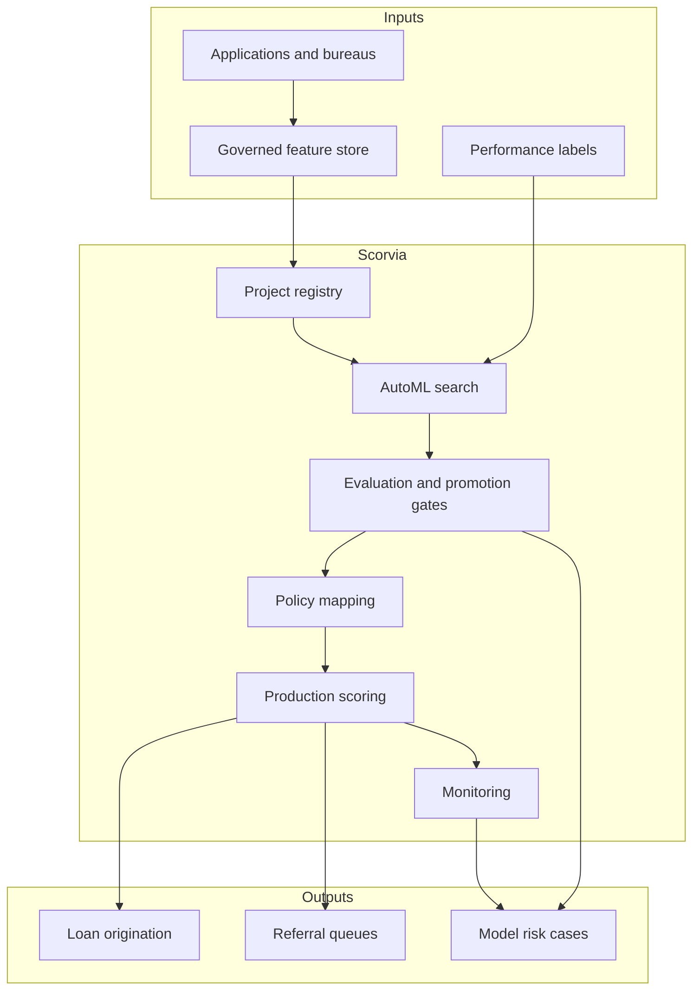

# Scorvia

**Source:** `ai-in-financial/aiinfinance-190206170721/`
**Domain:** `ai-fin`
**One-liner:** A governed AutoML credit-decision factory that promotes consumer and SME scoring models only when they clear interpretability, regime-stability, class-imbalance, and production-readiness gates—so PoCs stop masquerading as lending engines.
**Wedge:** Credit risk and analytics leaders at banks, consumer lenders, and P2P platforms that have notebook prototypes (Lending Club–style datasets, logistic baselines, neural nets) and cannot get them through model risk into production without months of rework.
**Positioning:** Production credit ML with AutoML acceleration under risk discipline. Sri Krishnamurthy / QuantUniversity’s 2019 finance ML briefing argues machine learning is not a generic solvent, prototypes are not production, “it works we don’t know how” is unacceptable, accuracy is often the wrong metric, and organisations are not ready for autopilot. Scorvia turns that caution list into hard promotion gates while still offering AutoML pipeline search for credit scoring use cases.

## Market research synthesis

### Thesis from source

The presentation *AI and Machine Learning in Finance* maps a paradigm shift from classical stochastic/factor/optimisation quant work toward real-time analytics, ML, RPA, NLP, graph analytics, alternative data, and chatbots—while insisting on an organisational appetite framework (citing FSB definitions of AI/ML). Opportunity sizing references McKinsey’s AI frontier use-case work, then drills into the practical workflow: data cleansing → feature engineering → train/test → model building → selection → deployment.

Five caution claims structure the product thesis. (1) ML is useful for fraud, arbitrage, and execution—but imbalanced classes make 99% accuracy potentially worthless. (2) Prototype success on sample data hides production pain; HSBC and Société Générale quotes emphasise that PoCs are the easy bit and RPA disillusionment follows when production shift fails. (3) “It works, we don’t know how” fails auditability; interpretability and codebase transparency matter as open-source tools proliferate. (4) Evaluation must choose the right metrics (RMS, R², regime behaviour)—not generic accuracy. (5) Hype that ML replaces humans ignores model risk; the destination is augmented intelligence with robust risk management. Bloomberg’s Wall Street automation glitches are cited as a warning.

Credit-risk chapters ground the wedge: grant/deny, limit and rate changes, product offers to existing customers; history from gut feel and social networks through bureau scores and rules to P2P (Prosper). Supervised prediction vs classification, parametric vs non-parametric models, AutoML (feature engineering automation, hyperparameter optimisation, model selection), and frameworks (AutoWEKA, auto-sklearn, TPOT, H2O AutoML, AutoKeras) are presented as accelerators—not escapes from interpretability, parsimony, and ensemble discipline.

Scorvia’s defensible product is therefore a credit-model factory: AutoML explores candidates; gates enforce imbalance-aware metrics, regime tests, interpretability artefacts, and production checklists before any score may drive a lending decision.

### Buyer & economic model

- **Primary buyer:** Head of Credit Risk Analytics or Chief Model Risk Officer co-sponsoring with Head of Consumer/SME Lending Technology.
- **Users:** data scientists, credit policy analysts, model validators, lending ops (exception queues), IT production owners, auditors.
- **Budget owner / value metric:** credit-loss and decisioning OPEX budgets. Value metrics: time from prototype to approved production model; validation cycle time; stability of approve/refer/decline mix across regimes; reduction in silent accuracy-only promotions; documented interpretability coverage.
- **Competing status quo:** data-science notebooks emailed to IT; vendor black-box scores; AutoML demos that skip model risk; separate “champion” bureau scorecards with no challenger governance.

### Domain constraints

- **Regulatory / trust / safety:** fair lending / disparate impact; model risk management (SR 11-7-style expectations); explainability for adverse action; auditability of open-source components; prohibition on autopilot for material credit decisions without human escalation paths.
- **Data sensitivity:** applicant PII, bureau attributes, alternative data; training sets with historical bias; need for purpose-limited feature stores.
- **Change-management realities:** data scientists optimise AUC; validators demand stability and narratives; business wants faster approvals. Scorvia must make gate failures visible and remediable rather than political.

## Business requirements

- BR-1: No credit model may drive automated grant/deny, limit, or pricing decisions until it passes declared production gates (data sufficiency, imbalance metrics, regime tests, interpretability pack, monitoring plan).
- BR-2: Default evaluation for classification must include imbalance-aware metrics (e.g. precision/recall on the minority default class, ROC/PR curves)—accuracy alone cannot pass a gate.
- BR-3: Probability-of-default outputs must be available alongside binary decisions for risk management use, consistent with the source’s preference for estimated probabilities over crude labels.
- BR-4: AutoML search results must retain candidate lineage (algorithm, hyperparameters, features) so validators can reconstruct how a challenger was chosen.
- BR-5: Interpretability artefacts (e.g. coefficient narratives, feature attributions, or surrogate explanations) must be attached before production approval for in-scope models.
- BR-6: Regime tests must show behaviour under stressed or shifted distributions; unexplained collapse blocks promotion.
- BR-7: Human referral queues must exist for borderline scores; full autopilot without referral policy is disallowed for material decisions.
- BR-8: Production monitoring must track drift, performance, and override rates; breach of thresholds opens a mandatory review.
- BR-9: Bias and disparate-impact checks appropriate to jurisdiction must be runnable before go-live and on a scheduled cadence.
- BR-10: PoC environments must be labelled and cannot share production scoring endpoints.
- BR-11: Audit exports must show who approved each promotion, which gates passed, and which waivers were granted.
- BR-12: Commercial success is measured by validated productionisation rate and decision quality—not by number of AutoML experiments run.

## User stories

Canonical user stories live in sibling [USER_STORIES.md](USER_STORIES.md).

## System design

### Overview

Scorvia manages credit modelling projects from dataset registration through AutoML candidate search, gated evaluation, policy mapping, production deployment, and monitoring. It does not replace the core loan origination system; it supplies approved scores, explanations, and referral flags into it.

### Actors & boundaries

- **Actors:** data scientists, validators, credit policy, lending ops, model risk, auditors, LOS/decisioning systems (machine actors).
- **Trust boundary:** PII stays in approved feature stores; AutoML workers see governed extracts; production scoring is isolated from PoC tenants.
- **Human-in-the-loop points:** gate waivers; production approval; referral decisions; monitoring incident disposition.

### Core capabilities

1. **Project and dataset registry** — purpose, population, labels, imbalance profile.
2. **Governed feature store access** — approved features only for search and scoring.
3. **AutoML candidate search** — algorithm/hyperparameter/pipeline exploration with lineage.
4. **Evaluation suites** — imbalance-aware metrics, regime tests, stability checks.
5. **Interpretability packs** — artefacts required for validation.
6. **Promotion gates and waivers** — production readiness checklist.
7. **Policy mapping** — PD to grant/refer/deny and pricing bands.
8. **Production scoring API** — approved models only.
9. **Monitoring and incident management** — drift, performance, overrides.
10. **Audit export** — promotions and waivers.

### Conceptual data

- **Primary entities:** CreditProject, Dataset, FeatureSet, AutoMLRun, CandidateModel, EvaluationReport, InterpretabilityPack, PromotionGate, Waiver, PolicyMap, ProductionDeployment, ScoreRequest, ScoreResult, Referral, MonitoringIncident, AuditExport.
- **Critical events:** dataset registered, AutoML completed, evaluation failed/passed, interpretability attached, promotion approved/rejected, score issued, referral opened, drift incident opened, model retired.
- **Retention / audit needs:** model lineage and promotion records retained for the model lifecycle plus regulatory lookback; score explanations retained with decision records; training PII minimised and access-logged.

### Integrations (conceptual)

- **Systems of record:** loan origination / decision engine, bureau gateways, customer master, model risk inventory.
- **Upstream signals:** application data, bureau and alternative data, payment performance labels, macro regime indicators.
- **Downstream actions:** approve/refer/decline instructions, limit/rate recommendations, monitoring tickets, validator worklists.

### High-level architecture

### Success metrics

- **Leading:** % AutoML candidates with complete lineage; gate pass rate on first attempt; median time in validation; % scores with explanation artefacts; monitoring coverage of production models.
- **Lagging:** time-to-production for new scorecards; stability of decision mix across regimes; reduction in accuracy-only promotion attempts; credit performance vs champion; audit exceptions closed.

## OpenAPI skeleton

Canonical HTTP surface lives in sibling [openapi.yaml](openapi.yaml). Summary:

- **Base path:** `/v1/...`
- **Auth:** Bearer JWT for scientists/validators/operators; `X-API-Key` for LOS scoring integration.
- **Resource groups:** Projects, AutoML, Evaluations, Promotions, Scoring, Referrals, Monitoring, Audits.
