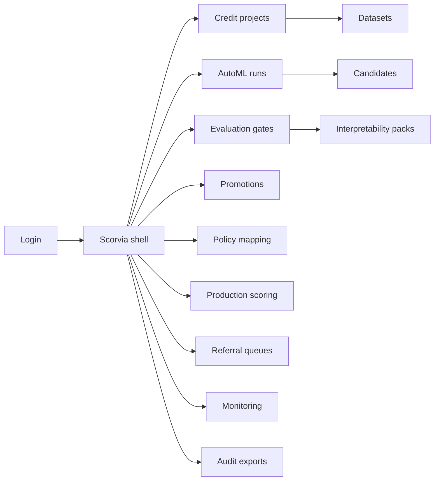
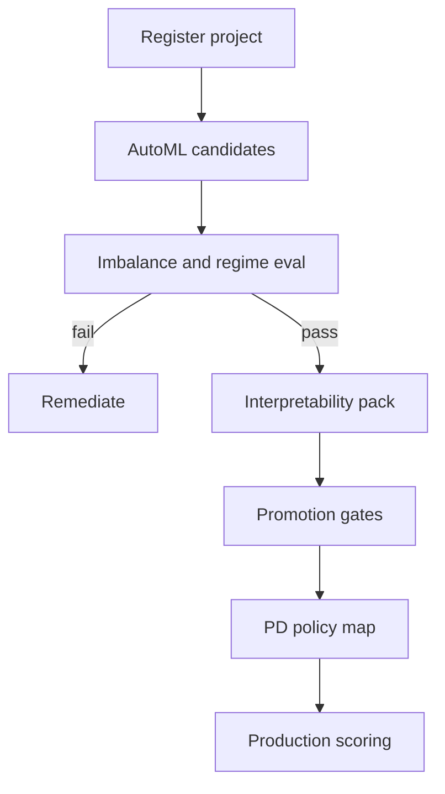

# Scorvia — Web app

**Product:** [PRODUCT.md](./PRODUCT.md)
**Primary surface:** Governed AutoML credit-model factory (search → gated eval → policy map → production score → monitor)
**Secondary surfaces:** Lending referral queue (ops); PoC sandbox label banner (read-only warning on non-prod)
**Design thesis:** Scorvia is a foundry that refuses to ship PoCs as lending engines—not a LOS, not a generic MLOps inventory, and not Lendora’s applicant decision UI. The metaphor is a metallurgy lab: charcoal bench, copper “candidate” heat, steel gate bars that accuracy alone cannot lift, and cool blue PD bands for policy-owned outcomes. AutoML is the furnace; interpretability packs and regime tests are the tensile reports. The Scorvia wordmark is a copper mint on every gate so scientists know experiments stay labelled until steel clears.

## UX research synthesis

### Category peers (best-in-class)

- **H2O AutoML / DataRobot AutoML consoles:** Candidate leaderboards with lineage (algorithm, hyperparams, features). Steal: retained candidate lineage for validators (BR-4); reject accuracy-sorted boards as the promotion authority (BR-2).
- **FICO / Experian model development workbenches:** Scorecard governance, PD bands, adverse-action factors. Steal: PD beside binary action and policy mapping (BR-3, policy analyst stories); reject black-box vendor score with no interpretability pack (BR-5).
- **SR 11-7 style model risk portals (internal bank MRM tools):** Promotion checklists, waivers, monitoring incidents. Steal: declared gates before any grant/deny drive (BR-1); reject rubber-stamp AUC.
- **Aequitas / fairlearn reporting UIs:** Disparate-impact checks before go-live. Steal: scheduled bias cadence (BR-9); reject “fairness optional” toggles.

### Patterns to adopt / reject

- **Adopt:** PoC vs production endpoint isolation; imbalance-aware eval as default; regime-test vault; interpretability pack required; referral queues for borderline; waiver audit; monitoring incidents auto-open.
- **Reject:** Cloning Lendora application seals as home; cloning Aetherlab GPU spend as home; autopilot without referral policy; accuracy-only pass; shared PoC/prod scoring URLs.

### Trust, density, and workflow constraints from PRODUCT.md

Data scientists optimise AUC; validators demand stability and narratives—gate failures must be remediable, not political. Commercial success is validated productionisation rate, not experiment count (BR-12). Material credit decisions disallow full autopilot without referral (BR-7).

## Information architecture

### Nav model

### Roles → default home

| Role | Default home | Why |
|------|--------------|-----|
| Credit data scientist | AutoML runs | Pipeline search on governed features |
| Model validator | Evaluation gates | Reject accuracy-only (BR-2) |
| Credit policy analyst | Policy mapping | PD bands → grant/refer/deny |
| Lending ops | Referral queues | Borderline human capacity (BR-7) |
| Model risk / audit | Monitoring + audits | Drift cases and promotion export |
| IT production owner | Production scoring | PoC≠prod endpoints (BR-10) |

### Cross-links to OpenAPI resources

| Nav area | OpenAPI tags / resources |
|----------|---------------------------|
| Projects / datasets | Projects |
| Pipeline search | AutoML |
| Imbalance / regime suites | Evaluations |
| Production readiness | Promotions |
| Approved scores to LOS | Scoring |
| Borderline human work | Referrals |
| Drift / override incidents | Monitoring |
| Promotions and waivers | Audits |

## Screen inventory

### Credit project registry

- **Purpose:** Register projects with purpose, population, labels, imbalance profile—before furnace heat.
- **Entry:** Scientist/validator shared.
- **Layout regions:** Project table; imbalance profile chip; PoC/prod label; population notes; link to feature set.
- **Primary actions:** Create project; attach dataset; open AutoML; mark PoC-only.
- **Empty / loading / error:** Empty = guided first project; missing imbalance profile blocks AutoML start.
- **BR / story ties:** BR-1, BR-10.

### AutoML run console

- **Purpose:** Search pipelines on governed features; retain candidate lineage.
- **Entry:** From project; scientist default.
- **Layout regions:** Run config; candidate leaderboard (not accuracy-primary sort—PR/minority class default); lineage drawer (algorithm, hyperparams, features); compare parametric vs tree/ensemble.
- **Primary actions:** Start run; pin candidates; open evaluation suite; discard PoC-only toys.
- **Empty / loading / error:** Feature set not governed = block; run fail with remediation hint.
- **BR / story ties:** BR-4; data scientist stories.

### Evaluation suite (imbalance + regime)

- **Purpose:** Imbalance-aware metrics and regime tests; accuracy alone cannot pass.
- **Entry:** From candidate; validator default work.
- **Layout regions:** PR/ROC and minority-class precision/recall; regime/stress panels; stability vs champion; fail reasons with remediation hints.
- **Primary actions:** Run suite; fail gate; request retrain; store immutable baseline.
- **Empty / loading / error:** Accuracy-only submission auto-fail banner (BR-2, BR-6).
- **BR / story ties:** BR-2, BR-6; validator stories.

### Interpretability pack

- **Purpose:** Attach coefficient narratives, attributions, or surrogates before production approval.
- **Entry:** Gate checklist item.
- **Layout regions:** Artefact list; reviewer notes; adverse-action factor preview; IP-safe customer vs validator views.
- **Primary actions:** Upload/generate pack; certify complete; block promote if missing.
- **Empty / loading / error:** Missing pack = steel gate locked (BR-5).
- **BR / story ties:** BR-5.

### Promotion and waiver desk

- **Purpose:** Declared production gates; waivers attributable and exported.
- **Entry:** Eval passed; MRM.
- **Layout regions:** Gate checklist (data sufficiency, imbalance, regime, interpretability, monitoring plan); waiver form; approver slots; PoC endpoint warning.
- **Primary actions:** Approve; reject; grant waiver (audited); refuse if PoC endpoint selected.
- **Empty / loading / error:** Incomplete gates block; PoC/prod share attempt blocked (BR-1, BR-10, BR-11).
- **BR / story ties:** BR-1, BR-11.

### Policy mapping (PD bands)

- **Purpose:** Map PD to grant/refer/deny and pricing—policy owns the decision, not the model alone.
- **Entry:** Policy analyst default.
- **Layout regions:** PD continuum; band editor; referral threshold; pricing bands; override reason taxonomy.
- **Primary actions:** Publish map; simulate mix; version policy.
- **Empty / loading / error:** No referral band = autopilot disallowed warning (BR-3, BR-7).
- **BR / story ties:** BR-3, BR-7; policy analyst stories.

### Production scoring health

- **Purpose:** Approved models only; clear separation from PoC scores in downstream systems.
- **Entry:** IT production; LOS integration status.
- **Layout regions:** Endpoint inventory; model version; PoC vs prod banners; score volume; explanation attach rate.
- **Primary actions:** Rotate keys; retire model; verify LOS points at prod only.
- **Empty / loading / error:** PoC bleed detected = scrap red banner (BR-10).
- **BR / story ties:** BR-10; lending ops story.

### Referral queue

- **Purpose:** Borderline scores for human review, prioritised by expected loss impact.
- **Entry:** Lending ops default.
- **Layout regions:** Prioritised referrals; PD + explanation; policy band; resolve controls; override capture.
- **Primary actions:** Resolve; capture override reason; escalate.
- **Empty / loading / error:** Empty = healthy straight-through within policy.
- **BR / story ties:** BR-7; lending ops stories.

### Monitoring incidents

- **Purpose:** Drift, performance, override-rate breaches open mandatory review.
- **Entry:** Model risk; auto from thresholds.
- **Layout regions:** Incident queue; metric charts; disposition; link to promotion baseline.
- **Primary actions:** Acknowledge; open MRM case; force review/rollback.
- **Empty / loading / error:** Unmonitored prod model = gate violation (BR-8).
- **BR / story ties:** BR-8.

### Bias and disparate-impact cadence

- **Purpose:** Jurisdiction-appropriate checks before go-live and on schedule.
- **Entry:** From promotion checklist; scheduled.
- **Layout regions:** Check results; segment impacts; cadence calendar; block/warn states.
- **Primary actions:** Run check; attach to promotion; schedule.
- **Empty / loading / error:** Failed check blocks go-live unless waiver (BR-9).
- **BR / story ties:** BR-9.

### Audit export

- **Purpose:** Who approved, which gates passed, which waivers—period examination evidence.
- **Entry:** Auditor.
- **Layout regions:** Period picker; promotion/waiver/incident list; export.
- **Primary actions:** Generate; download.
- **Empty / loading / error:** Incomplete attribution listed (BR-11).
- **BR / story ties:** BR-11; auditor stories.

## Key flows

1. **Prototype to production score** — project → AutoML → imbalance/regime eval → interpretability → promotion gates → policy map → prod score; failure: accuracy-only or missing pack.

2. **Borderline referral** — score in refer band → queue by expected loss → human resolve → override reason captured (BR-7).

3. **Drift mandatory review** — monitor breach → incident → disposition / rollback (BR-8).

4. **PoC isolation check** — LOS health scan → PoC endpoint bleed → block and alert (BR-10).

5. **Waiver audit** — exceptional promote → attributable waiver → period export (BR-11).

## Design system

### Tokens (CSS variables)

- `--color-ink: #E8E4DF` — text on charcoal
- `--color-charcoal-950: #12100E` — app ground
- `--color-charcoal-900: #1C1916` — panels
- `--color-copper: #B87333` — AutoML candidates / brand accent
- `--color-steel-gate: #8B9BB4` — locked gates
- `--color-steel-pass: #3D5A80` — passed gates
- `--color-pd-blue: #4C6EF5` — PD bands (cool, not purple marketing)
- `--color-scrap: #C0392B` — PoC bleed / failed accuracy-only
- `--color-ok: #2A9D8F` — monitoring healthy
- `--font-display: "IBM Plex Sans", sans-serif` — foundry chrome
- `--font-mono: "IBM Plex Mono", monospace` — run ids, hyperparams
- `--space-1`…`--space-8`: 4px scale
- `--radius-sm: 3px`; `--radius-md: 6px`
- `--motion-furnace: 200ms ease-out` — candidate heat flash
- `--motion-gate: 220ms ease-in-out` — steel bar lift on pass
- `--motion-bleed: 280ms ease-out` — PoC bleed banner
- Atmosphere: subtle slag-grain texture on charcoal; copper hairlines; no purple AutoML marketing; no stock “robot handshake” heroes.

### Typography & brand

- Plex Sans for titles and KPIs; mono for lineage fields.
- Copper wordmark on every gate; PoC environments always labelled in scrap-red banner.

### Do / don’t

- **Do:** Default sort by imbalance-aware metrics; require interpretability; isolate PoC endpoints; keep referral bands mandatory for material decisions.
- **Don’t:** Celebrate experiment count; AUC-only pass; Lendora applicant UI clone; Aetherlab cloud-cost as primary nav.

### Accessibility & domain trust cues

- Gate pass/fail text+icon; live regions for monitoring incidents and PoC bleed; focus: candidate → eval → pack → promote → policy → score.

## Component patterns

- **ImbalanceLeaderboard** — minority-class metrics first.
- **CandidateLineageDrawer** — algorithm, hyperparams, features.
- **RegimeTestVault** — stressed distribution results.
- **InterpretabilityPack** — required artefacts checklist.
- **SteelGateChecklist** — production readiness bars.
- **PdBandMapper** — policy-owned grant/refer/deny.
- **PocBleedBanner** — non-prod endpoint warning.
- **ReferralLossQueue** — prioritised by expected loss.

## Out of scope for v1 web

- Full LOS/LMS; generic multi-domain AI factory (Aetherlab); fraud case ops; consumer applicant portal; unconstrained notebook IDE hosting; autopilot without referral policy.
